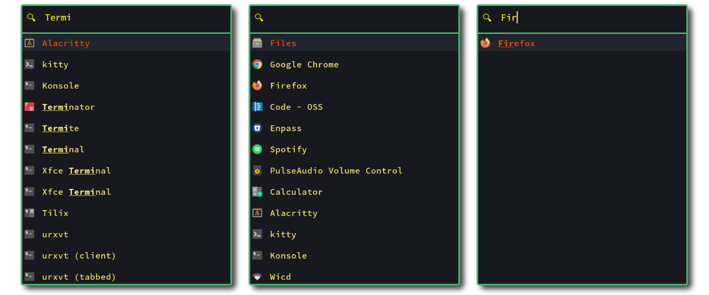

<p align="center"><p>


<p align="center">
   <a href="https://www.buymeacoffee.com/asirohi"></a>
</p>

<h2 align="center">Rofi Lighthaus</h2>

A [Lighthaus](https://github.com/lighthaus-theme/lighthaus) theme for [Rofi](https://github.com/davatorium/rofi).

### Table of Contents
- [Screenshots](#screenshots)
- [Installation](#installation)
- [Contributing](#contributing)
- [Version](#version)
- [Bugs/Issues](#bugs/issues)
- [License](#license)

### Screenshots

<p align="center"><p>


Font used in the screenshots: [Source Code Pro for Powerline](https://github.com/powerline/fonts/tree/master/SourceCodePro)

### Installation

To use the Lighthaus theme for Rofi, download [`lighthaus.rasi`](https://github.com/lighthaus-theme/rofi/blob/master/src/lighthaus.rasi) file and paste in it your `~/.config/rofi/` folder.

Edit your `config` file and add the following line to it
```
rofi.theme:     ~/.config/rofi/lighthaus.rasi
```

The `font` section of `lighthaus.rasi` has been commented out. Please edit it to use the desired font.   

_The `config` can be found in your `~/.config/rofi`. For more information refer to the [official project documentation](https://github.com/davatorium/rofi/wiki/themes)._

### Contributing

Check out [CONTRIBUTING](https://github.com/lighthaus-theme/lighthaus/blob/master/CONTRIBUTING.md). 

Pull Request Template can be found [here](https://github.com/lighthaus-theme/lighthaus/blob/master/PULL_REQUEST_TEMPLATE.md) and Issues and Bugs Template [here](https://github.com/lighthaus-theme/lighthaus/blob/master/ISSUE_TEMPLATE.md).

### Version

```vim
v 1.0.1
```

_Lighthaus and all it's projects use [Semantic Versioning](https://semver.org/)._ <br/>
_All changes are recorded in [CHANGELOG](https://github.com/lighthaus-theme/rofi/blob/master/CHANGELOG.md)_

### Bugs/Issues
Please report any bugs or issues [here](https://github.com/lighthaus-theme/rofi/issues). Issues and Bugs Template can be found [here](https://github.com/lighthaus-theme/lighthaus/blob/master/ISSUE_TEMPLATE.md).

### License 

_Copyright © 2020-Present Lighthaus Theme_  
_Copyright © 2020-Present Adhiraj Sirohi_  
_Copyright © 2020-Present Vasundhara Sharma_

<p align="left"><a href="https://github.com/lighthaus-theme/rofi/blob/master/LICENSE"></a></p>

<p align="center"><p>

